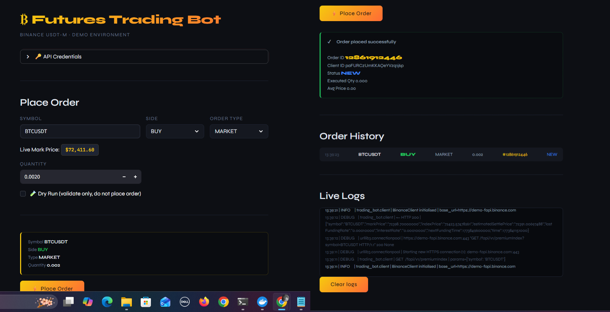
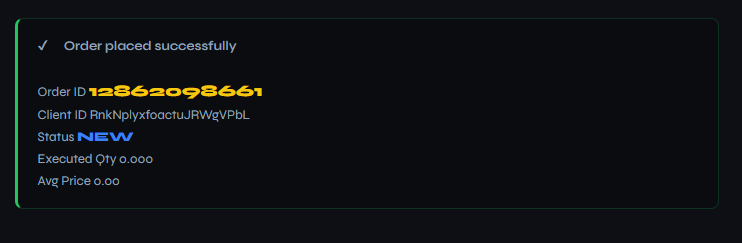
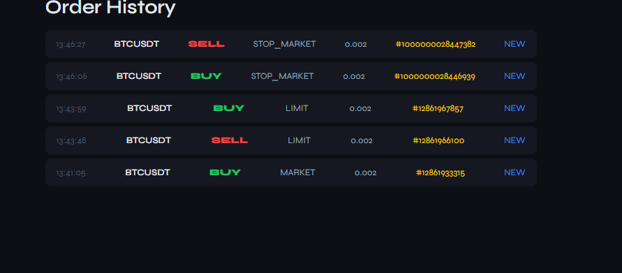
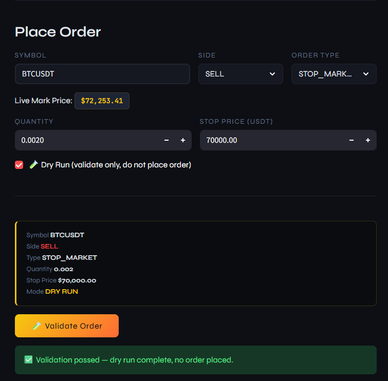
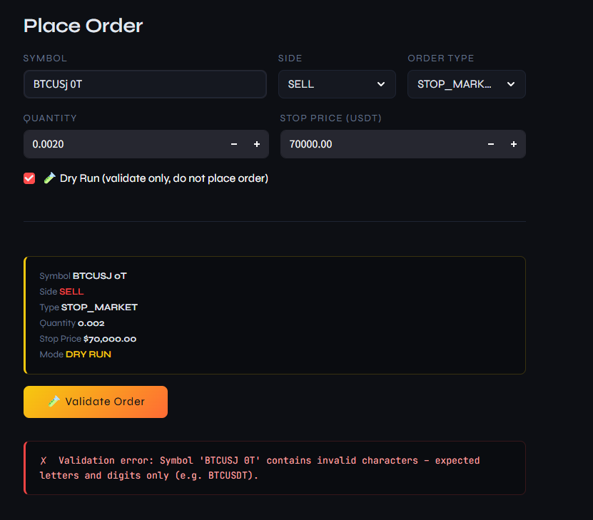
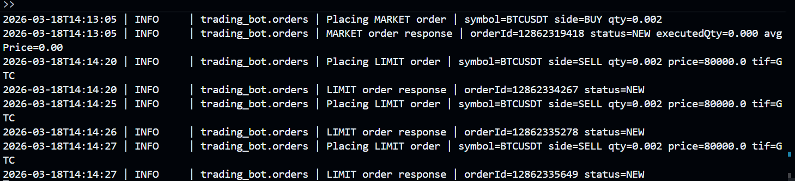

# Binance Futures Trading Bot

A Python CLI + Streamlit UI for placing orders on Binance Futures (USDT-M demo environment). Built with plain `requests` — no SDK.

---

## What it does

- Places **MARKET**, **LIMIT**, and **STOP_MARKET** orders
- Supports **BUY** and **SELL** on any USDT-M futures pair
- Two ways to use it: **CLI** for scripting, **Streamlit UI** for interactive trading
- Validates all inputs before hitting the API — catches bad prices, missing fields, wrong stop directions
- Logs everything to a rotating file (`logs/trading_bot.log`) and shows clean logs in the UI

---

## Project structure

```
trading_bot/
├── bot/
│   ├── client.py          # REST client — signing, retries, error handling
│   ├── orders.py          # order logic — market, limit, stop
│   ├── validators.py      # input validation
│   └── logging_config.py  # rotating file + console logging
├── cli.py                 # CLI entry point (argparse)
├── app.py                 # Streamlit UI
├── logs/
│   └── trading_bot.log    # real testnet run logs
├── Dockerfile
├── .env.example
└── requirements.txt
```

---

## Setup

### Prerequisites

- Docker (recommended), or Python 3.9+
- A Binance account with Demo Trading access

### Get API credentials

1. Go to [demo.binance.com](https://demo.binance.com) and start demo trading
2. Click your profile → **API Management**
3. Create a new HMAC key
4. Copy the API Key and Secret — the secret is only shown once

### Configure credentials

```bash
cp .env.example .env
```

Edit `.env`:

```dotenv
BINANCE_API_KEY=your_api_key_here
BINANCE_SECRET_KEY=your_secret_key_here
```

---

## Running with Docker

This is the recommended way — no Python setup needed.

```bash
# Build
docker build -t trading-bot .

# Launch the Streamlit UI
docker run --env-file .env -p 8501:8501 trading-bot
```

Then open **http://localhost:8501** in your browser.

To persist logs on your machine:

```bash
docker run --env-file .env -p 8501:8501 -v ${PWD}/logs:/app/logs trading-bot
```

---

## Streamlit UI

<!-- Screenshot: full UI with order form and live mark price badge -->


Fill in the form, check the order summary, and click **Place Order**.

### Successful order

<!-- Screenshot: green response box showing orderId, status, executedQty -->


### Order history

<!-- Screenshot: order history table showing multiple orders -->


### Dry run mode

Tick **Dry Run** to validate without placing. Useful for checking your inputs before going live.

<!-- Screenshot: dry run confirmation message -->


### Validation errors

The bot catches bad inputs before they reach the API.

<!-- Screenshot: red error box showing validation message -->


### Live logs

<!-- Screenshot: live log panel in UI showing order placement lines -->


---

## CLI

You can also use the CLI directly — useful for scripting or automation.

```bash
# via Docker
docker run --env-file .env --entrypoint python trading-bot cli.py [options]

# or locally
python cli.py [options]
```

### Examples

```bash
# Market BUY
python cli.py --symbol BTCUSDT --side BUY --type MARKET --quantity 0.002

# Limit SELL
python cli.py --symbol BTCUSDT --side SELL --type LIMIT --quantity 0.002 --price 80000

# Stop-Market BUY (stop price must be above current market price)
python cli.py --symbol BTCUSDT --side BUY --type STOP_MARKET --quantity 0.002 --stop-price 85000

# Dry run — validate without placing
python cli.py --symbol BTCUSDT --side BUY --type MARKET --quantity 0.002 --dry-run

# Raw JSON output for scripting
python cli.py --symbol BTCUSDT --side BUY --type MARKET --quantity 0.002 --json

# Debug logging to console
python cli.py --symbol BTCUSDT --side BUY --type MARKET --quantity 0.002 --log-level DEBUG
```

### CLI output example

```
━━━━━━━━━━━━━━━━━━━━━━━━━━━━━━━━━━━━━━━━━━━━━━━━━━━━━━
  ORDER REQUEST SUMMARY
━━━━━━━━━━━━━━━━━━━━━━━━━━━━━━━━━━━━━━━━━━━━━━━━━━━━━━
  Symbol:                BTCUSDT
  Side:                  BUY
  Type:                  MARKET
  Quantity:              0.002
──────────────────────────────────────────────────────

━━━━━━━━━━━━━━━━━━━━━━━━━━━━━━━━━━━━━━━━━━━━━━━━━━━━━━
  ORDER RESPONSE DETAILS
━━━━━━━━━━━━━━━━━━━━━━━━━━━━━━━━━━━━━━━━━━━━━━━━━━━━━━
  Order ID:              12859564799
  Status:                NEW
  Orig Qty:              0.002
  Executed Qty:          0.000
  Avg Price:             0.00
──────────────────────────────────────────────────────

✔  Order placed successfully!
```

---

## All CLI flags

```
--symbol      Trading pair (e.g. BTCUSDT)
--side        BUY or SELL
--type        MARKET | LIMIT | STOP_MARKET
--quantity    Order size
--price       Limit price — required for LIMIT
--stop-price  Trigger price — required for STOP_MARKET
--tif         Time in force: GTC (default) | IOC | FOK
--dry-run     Validate only, do not place
--json        Print raw Binance JSON response
--log-level   Console log level: DEBUG | INFO | WARNING | ERROR
```

---

## Error handling

The bot handles errors at three levels:

**Input validation** (before any API call):
```
✗  Validation error: Price is required for LIMIT orders.
✗  Validation error: Quantity must be greater than 0, got -1.
✗  Validation error: BUY STOP_MARKET trigger 60000 must be above current mark price 74150.
```

**Binance API errors**:
```
✗  Binance API error (code -4016): Limit price can't be higher than 75779.79.
✗  Binance API error (code -2015): Invalid API-key, IP, or permissions for action.
```

**Network failures**:
```
✗  Network error: Connection failed: Max retries exceeded.
```

Exit codes: `0` success, `1` config error, `2` validation error, `3` API error, `4` network error.

---

## Logging

All runs append to `logs/trading_bot.log`. The file rotates at 5 MB and keeps 5 backups.

Sample log output:

```
2026-03-18T13:54:01 | INFO     | trading_bot.orders | Placing MARKET order | symbol=BTCUSDT side=BUY qty=0.002
2026-03-18T13:54:01 | INFO     | trading_bot.orders | MARKET order response | orderId=12862089357 status=NEW executedQty=0.000 avgPrice=0.00
2026-03-18T13:54:37 | ERROR    | trading_bot.client | Binance error | code=-4016 msg=Limit price can't be higher than 75779.79.
2026-03-18T13:54:46 | INFO     | trading_bot.orders | LIMIT order response | orderId=12862098661 status=NEW
```

<!-- Screenshot: terminal showing live structured log output -->


Real log files from testnet runs are included in `logs/trading_bot.log`.

---

## Running locally (without Docker)

```bash
python3 -m venv .venv
source .venv/bin/activate   # Windows: .venv\Scripts\activate
pip install -r requirements.txt

# UI
streamlit run app.py

# CLI
python cli.py --symbol BTCUSDT --side BUY --type MARKET --quantity 0.002
```

---

## Assumptions

- Tested against `https://demo-fapi.binance.com` — Binance's current futures demo endpoint. The original `testnet.binancefuture.com` URL now redirects to this environment. All orders were placed and verified successfully.
- Minimum order notional is ~$100 on the demo environment. For BTCUSDT at ~$74,000, use `--quantity 0.002` or higher.
- STOP_MARKET orders use the Algo Service endpoint (`POST /fapi/v1/algoOrder`) as required by Binance since December 2025. The bot validates stop price direction against the live mark price before submitting.
- One-way position mode (`positionSide=BOTH`) assumed. Hedge mode not supported.
- Quantities and prices use Python `Decimal` internally to avoid floating-point issues.
- Credentials are never logged — the signature is redacted in all debug output.

---

## Requirements

- Python 3.9+
- requests >= 2.31.0
- python-dotenv >= 1.0.0
- urllib3 >= 2.0.0
- streamlit >= 1.35.0